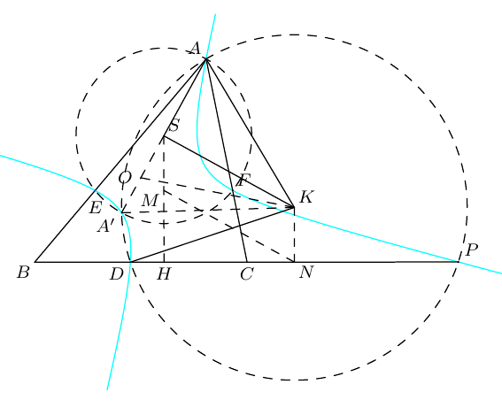
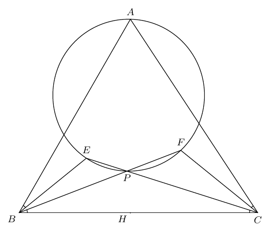

<p align="center">
  
</p>

<h1 align="center">AGCN</h1>

<p align="center"><strong>Asymptote GeoGebra Converter Nya~</strong></p>

<p align="center">
  将 GeoGebra <code>.ggb</code> 文件转换为结构清晰、可继续编辑的 Asymptote <code>.asy</code> 代码。
</p>

<p align="center">
  <a href="https://geogebra-to-asymptote.vercel.app/">在线体验</a> ·
  <a href="#快速开始">快速开始</a> ·
  <a href="docs/USAGE.zh-CN.md">使用手册</a> ·
  <a href="#部署网页版">部署网页版</a>
</p>

<p align="center">
  
  
  
</p>

AGCN 直接读取 `.ggb` 压缩包中的 `geogebra.xml`，提取点、线、圆锥曲线、标签和样式，不依赖 GeoGebra 桌面程序。默认输出面向数学排版：主体线保持黑色，同时保留虚实线和有意义的彩色对象。

## 在线体验

如果你很懒，可以直接使用[在线转换器](https://geogebra-to-asymptote.vercel.app/)：无需安装，上传后即可下载 `.asy` 文件。目前单个文件上限为 4 MB，文件仅在服务端临时处理，响应结束后立即删除。

## 部署网页版

[](https://vercel.com/new/clone?repository-url=https%3A%2F%2Fgithub.com%2Fgooodpig%2FAGCN&root-directory=web&project-name=agcn&repository-name=agcn)

按钮会克隆本仓库，并自动将 `web` 设为 Vercel 项目根目录。网页版包含 Next.js 前端和用于临时处理 `.ggb` 文件的 Python Function。

## 主要功能

- 读取 GeoGebra 点、线段、直线、射线、向量、多边形和折线
- 转换圆、圆弧、椭圆、双曲线，以及 GeoGebra 隐式三次曲线
- 转换常见显式函数、坐标轴、网格和锐角标记
- 自动识别实线、虚线、点线、点划线和对象颜色
- 将 GeoGebra 默认灰色主体线转换为适合排版的黑色
- 默认蓝色点输出为黑色，曲线与直线的交点不额外加 `dot()`
- 使用全局标签布局按文字边界框联合安排方向和距离，避让其他标签、点、直线、圆和圆锥曲线
- 将 GeoGebra 手工标签位置作为优先偏好，发生压线或碰撞时自动调整
- 自动缩放画布，避免输出图片留白过多
- 提供命令行工具和可复用的 Python API

## 环境要求

- Python 3.10 或更高版本
- 生成 `.asy` 不需要安装 GeoGebra
- 如需编译为 PDF、PNG 或 EPS，需要安装 Asymptote

## 安装

在项目目录中执行：

```powershell
py -m venv .venv
.\.venv\Scripts\Activate.ps1
python -m pip install -e .
```

确认命令已经安装：

```powershell
ggb2asy --help
```

如果 PowerShell 提示无法执行激活脚本，可以先在当前窗口运行：

```powershell
Set-ExecutionPolicy -Scope Process Bypass
```

## 快速开始

转换单个文件：

```powershell
ggb2asy "input.ggb" -o "output.asy"
```

省略 `-o` 时，输出文件与输入文件同名：

```powershell
ggb2asy "几何题.ggb"
# 生成：几何题.asy
```

如果系统找不到 `ggb2asy`，可使用模块方式运行：

```powershell
python -m grapher.cli "input.ggb" -o "output.asy"
```

## 示例

`example` 文件夹提供三个可直接转换的 GeoGebra 文件。每个示例均包含原始 `.ggb` 和生成的 `.asy`；部分示例另附编译预览图。

### 示例 1：Iran TST 2009

- [GeoGebra 源文件](example/1-iran-tst-2009.ggb)
- [生成的 Asymptote 代码](example/1-iran-tst-2009.asy)
- 文件来源：[vEnhance/dragon — Iran.ggb](https://github.com/vEnhance/dragon/blob/master/Iran.ggb)

```powershell
ggb2asy "example\1-iran-tst-2009.ggb" -o "example\1-iran-tst-2009.asy"
```

### 示例 2：2026 希望联盟 3-5



- [GeoGebra 源文件](example/2-2026希望联盟3-5.ggb)
- [生成的 Asymptote 代码](example/2-2026希望联盟3-5.asy)

```powershell
ggb2asy "example\2-2026希望联盟3-5.ggb" -o "example\2-2026希望联盟3-5.asy"
```

### 示例 3：XMO 2019 P2



- [GeoGebra 源文件](example/3-xmo19p2.ggb)
- [生成的 Asymptote 代码](example/3-xmo19p2.asy)

```powershell
ggb2asy "example\3-xmo19p2.ggb" -o "example\3-xmo19p2.asy"
```

## 常用选项

```text
ggb2asy INPUT [-o OUTPUT] [--preserve-style] [--debug]
```

| 选项 | 作用 |
| --- | --- |
| `INPUT` | 输入的 GeoGebra `.ggb` 文件 |
| `-o`, `--output` | 指定输出 `.asy` 文件 |
| `--preserve-style` | 精确保留 GeoGebra 颜色（包括灰色）和线宽 |
| `--debug` | 在输出中加入解析信息、警告和不支持对象的注释 |

默认模式更适合数学排版：灰色主体线转为黑色，彩色曲线继续保留颜色，虚实线保持不变。

## 编译 Asymptote

生成 `.asy` 后，可使用 Asymptote 编译：

```powershell
asy "output.asy"
```

通常会得到 `output.pdf`。也可以明确指定格式：

```powershell
asy -f pdf "output.asy"
asy -f png "output.asy"
asy -f eps "output.asy"
```

## Python API

```python
from grapher import convert_ggb_to_asy

result = convert_ggb_to_asy(
    "input.ggb",
    "output.asy",
    preserve_style=False,
    debug=False,
)

print(result.warnings)
```

如果不提供输出路径，代码只会保存在返回结果中：

```python
result = convert_ggb_to_asy("input.ggb")
print(result.code)
```

## 文档

更完整的安装、样式规则、输出说明、故障排查和开发文档请参阅：

- [完整使用手册](docs/USAGE.zh-CN.md)

## 测试

```powershell
python -m unittest discover -s tests -v
```

## 当前限制

- 转换目标是可编辑、适合排版的静态 Asymptote 图，不会复刻 GeoGebra 的动态交互
- 复杂填充、透明度、图片、文本框和部分高级对象可能无法完整转换
- 极其拥挤的图形仍可能需要手工微调少量标签
- 一般二次曲线和隐式三次曲线通过 Asymptote `contour` 绘制，编译时间会略长

